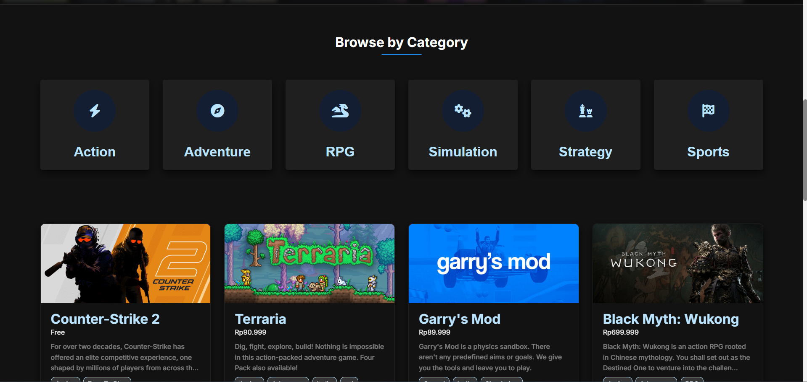
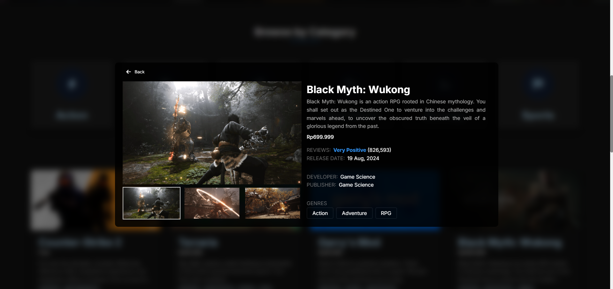

# 🎮 GameSage v2

GameSage is a content-based game recommendation system that helps players discover new titles they’ll love. Using a custom dataset of 6000+ Steam games, the system applies K-Nearest Neighbors (KNN) with cosine similarity to match users with games similar to their preferences. 
By combining categorical features (like genres/tags) and textual features (processed with transformers), GameSage delivers personalized recommendations in a simple and scalable way.

## 🔄 What’s New?

This revamped version brings several major improvements over the original GameSage:  

- 🚀 **React Frontend** – A modern, responsive interface for a smoother and more intuitive user experience.  
- 🎨 **Cleaner UI** – Updated design with improved layouts and better readability.  
- 🔄 **Infinite Scroll** – Games dynamically load as you scroll, making discovery seamless without manual page navigation.  
- ⚡ **Better Performance** – Optimized interaction between the backend and frontend for faster responses. 

## ✨ Technologies  

- React
- Python  
- Scikit-learn (KNN, cosine similarity)  
- Transformers (textual feature extraction)  
- Pandas & NumPy
- Steam Web API  

## 🚀 Features  

- Custom dataset of 6000+ games fetched from the Steam Web API  
- Content-based recommendation using categorical and textual features  
- K-Nearest Neighbors (KNN) model with cosine similarity  
- Extendable dataset pipeline for adding new games  
- Clean structure for experimentation and model improvement  

## 📊 Dataset  

- Fetched via Steam API (game list, details, reviews)  
- Transformed into a structured custom dataset with 6000+ entries  
- Includes both categorical features (e.g., genres, tags, platforms) and textual features (e.g., game descriptions, user reviews)  
- Applied data cleaning (removing duplicates, handling missing values, and normalizing text) to ensure dataset quality  

## 🌠 The Process  

The idea behind GameSage was to build a practical and scalable recommendation system tailored for gamers. Rather than relying on user-user collaborative filtering, we focused on content-based filtering, which lets the system work well even for lesser-known games. We started by fetching data directly from Steam’s API, performing data cleaning (removing duplicates, handling missing values, and normalizing text), and shaping it into a structured dataset. From there, we applied both categorical encodings and transformer-based embeddings for textual data. With KNN and cosine similarity as the model core, GameSage can recommend games based on a player’s favorite title, genre, or description.

## ⚙️ Running the Project  

### 🔑 Data Fetch through Steam API (Optional)

1. Create a `.env` file in the project root and add your Steam API key:
```bash
STEAM_API_KEY=your_private_key_here
```
2. Run the fetch script to build the dataset:  
```bash
python main.py
```

### 💻 Run the Application

#### 1️⃣ Backend (Flask)  
```bash
cd src
pip install -r requirements.txt
flask run
```

#### 2️⃣ Frontend (React) 
From the project root folder, run:
```bash
npm install
npm run dev
``` 

## 📸 Screenshots  

  
  
  

## 📝 License  

MIT License © 2025 Kenzie Junaidi
